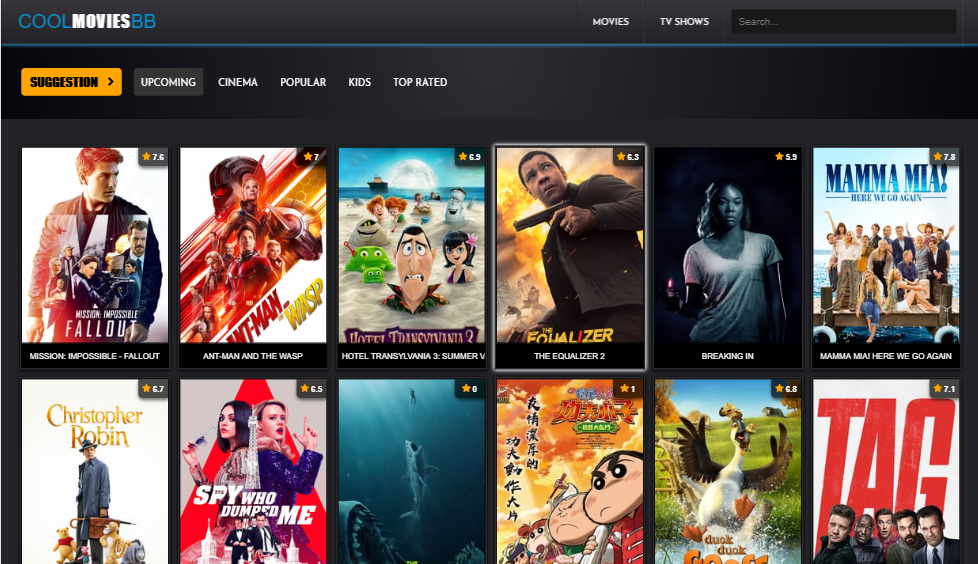

# CoolMoviesBB React App

CoolMoviesBB is a responsive React-Redux app that allows the user to search Movies and TvShows. This project is fetching data from The Movie Database https://www.themoviedb.org/.

## Preview

You can check the live website [Here](https://msmatki.github.io/React-Redux-Movies/)

## Screenshot

## How run on your local machine

* To run this file, download the GitHub zip file or clone the repository.
* Open the root folder of the repository in a terminal
* Get started by intalling npm, please follow this tutorial - http://blog.npmjs.org/post/85484771375/how-to-install-npm
* install all project dependencies with `npm install`
* start the development server with `npm start`

## Create React App

This project was bootstrapped with [Create React App](https://github.com/facebookincubator/create-react-app). You can find more information on how to perform common tasks [here](https://github.com/facebookincubator/create-react-app/blob/master/packages/react-scripts/template/README.md).

## How to run the project in Production Mode

* Build the production ready optimised code. npm run build
* Deploy it to gh-pages branch by npm run deploy

## Copyright and License

Copyright 2018 By Bartol. Code released under the [MIT](https://github.com/MsMatki/React-Movies/blob/master/LICENSE) license.

## Technologies Used

* React.js - A JavaScript library for building user interfaces.
* Redux - Open-source JavaScript library for managing application state.
* React Router - Standard routing library for React.
* Thunk - A thunk is a function that wraps an expression to delay its evaluation.
* DebounceInput - React component that renders an Input, Textarea or other element with debounced onChange. 
* FontAwesome - The internet's most popular icon toolkit.
* jQuery - Cross-platform JavaScript library.
